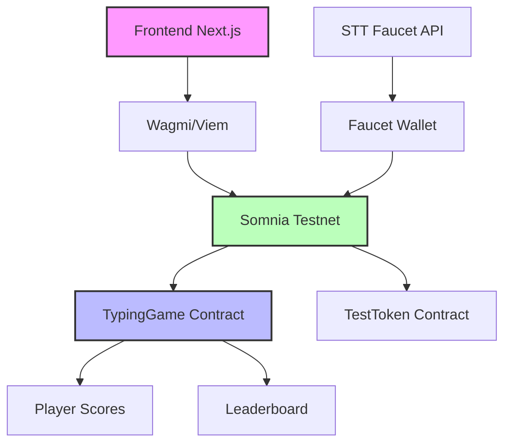

# 📋 Contract Addresses - TypeFi on Somnia Testnet

## Deployment Information

**Network**: Somnia Testnet  
**Chain ID**: 50312  
**RPC URL**: https://dream-rpc.somnia.network/  
**Block Explorer**: https://somnia-testnet-explorer.io/  
**Deployment Date**: September 17, 2025  

## Smart Contracts

### TypingGame Contract
- **Address**: `0x6C00b6b037c988A93132C1106bDaa3B663A8F536`
- **Purpose**: Main game logic, player entry, score submission, and leaderboard
- **Explorer**: [View on Explorer](https://dreamscout.somnia.network/address/0x6C00b6b037c988A93132C1106bDaa3B663A8F536)
- **Verified**: ✅ Yes

#### Key Functions:
- `enter()` - Join the typing competition (no staking required)
- `submitScore(uint256 wpm, uint256 accuracy)` - Submit typing test results
- `getScores()` - Retrieve all submitted scores for leaderboard
- `resetPlayer(address player)` - Reset player entry status (owner only)
- `hasEntered(address player)` - Check if player has entered competition

### TestToken Contract
- **Address**: `0x84FEA364EE5c4cc4dF14BD2AcD439251c0c4eaEa`
- **Purpose**: ERC20 test token for development and testing
- **Symbol**: TEST
- **Decimals**: 18
- **Explorer**: [View on Explorer](https://dreamscout.somnia.network/address/0x84FEA364EE5c4cc4dF14BD2AcD439251c0c4eaEa)
- **Verified**: ✅ Yes

#### Key Functions:
- `faucet(uint256 amount)` - Mint test tokens (max 1000 per call)
- `mint(address to, uint256 amount)` - Mint tokens to address
- `balanceOf(address account)` - Check token balance
- `approve(address spender, uint256 amount)` - Approve token spending

## Deployment Configuration

### Hardhat Network Config
```javascript
somniaTestnet: {
  url: "https://dream-rpc.somnia.network/",
  chainId: 50312,
  accounts: {
    mnemonic: process.env.MNEMONIC || "test test test test test test test test test test test junk"
  }
}
```

### Frontend Configuration
```typescript
// Contract addresses in frontend/config/contracts.ts
export const TYPING_GAME_ADDRESS = '0x6C00b6b037c988A93132C1106bDaa3B663A8F536';
export const TEST_TOKEN_ADDRESS = '0x84FEA364EE5c4cc4dF14BD2AcD439251c0c4eaEa';
```

## STT Faucet Details

### Faucet Wallet
- **Address**: `0x1Ec36230519A48451Ca3085A6543CE862e36AEff`
- **Balance**: ~45.17 STT (as of deployment)
- **Purpose**: Provides free STT tokens for gas fees

### Faucet API
- **Endpoint**: `/api/faucet`
- **Method**: POST
- **Payload**: `{ "recipient": "0x..." }`
- **Amount**: 1 STT per request
- **Limit**: 0.5 STT minimum balance check

## Gas Estimates

| Function | Estimated Gas | STT Cost (6 Gwei) |
|----------|---------------|-------------------|
| `enter()` | ~45,000 | ~0.00027 STT |
| `submitScore()` | ~55,000 | ~0.00033 STT |
| `getScores()` | 0 (view) | Free |
| Token Transfer | ~21,000 | ~0.000126 STT |

## Architecture Overview



## Security Considerations

### Contract Security
- ✅ No external dependencies beyond OpenZeppelin
- ✅ Simple game logic reduces attack surface  
- ✅ No token transfers or financial operations
- ✅ Owner-only functions for admin operations
- ✅ Input validation on score submission

### Faucet Security
- ✅ Rate limiting by balance checking
- ✅ Maximum amount per request
- ✅ Gas estimation and error handling
- ✅ Private key stored securely (not in code)

## Testing

### Contract Tests
```bash
cd blockend
npx hardhat test
```

### Integration Tests
- ✅ Contract deployment
- ✅ Player entry functionality
- ✅ Score submission and retrieval
- ✅ Frontend wallet connection
- ✅ End-to-end game flow

## Maintenance

### Contract Upgrades
- Current contracts are not upgradeable
- New versions require fresh deployment
- Migration tools available for score transfer

### Monitoring
- Track gas usage and optimize
- Monitor faucet balance and refill
- Log game statistics and player activity

---

*Last updated: September 17, 2025*  
*Network: Somnia Testnet (Chain ID: 50312)*